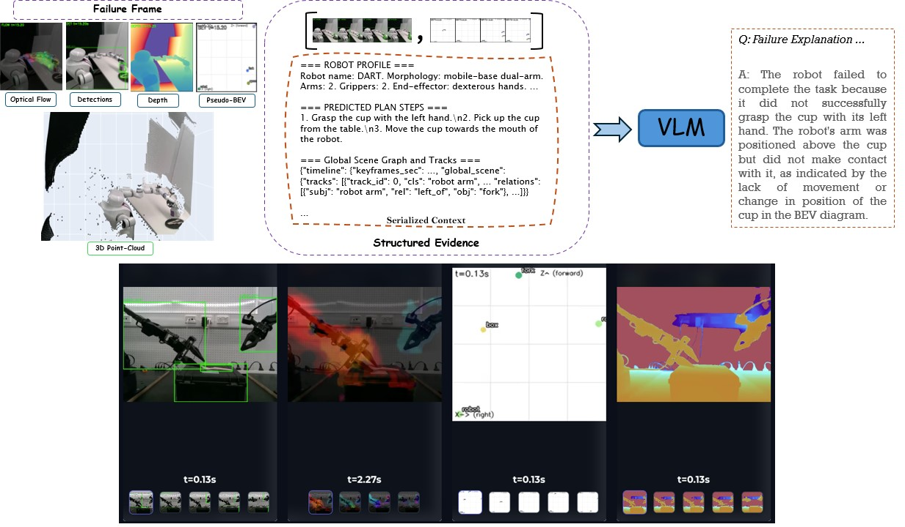

<p align="center">
  <h1 align="center">KITE [ICRA 2026]</h1>
  <h3 align="center">Keyframe-Indexed Tokenized Evidence for VLM-Based Robot Failure Analysis</h3>
 <p align="center">
    <a href="https://m80hz.github.io/" target="_blank">Mehdi Hosseinzadeh</a>
    &nbsp;&nbsp;&nbsp;&nbsp;
    <a href="#">King Hang Wong</a>
    &nbsp;&nbsp;&nbsp;&nbsp;
    <a href="https://ferasdayoub.com/" target="_blank">Feras Dayoub</a>
  </p>
 
 <h5 align="center">The Australian Institute for Machine Learning (AIML), Adelaide University, Australia</h5>

  <p align="center">
    <a href="https://m80hz.github.io/kite/" target="_blank">
      
    </a>
    &nbsp;
    <a href="https://arxiv.org/abs/2604.07034" target="_blank">
      
    </a>
    &nbsp;
    <a href="https://github.com/m80hz/kite" target="_blank">
      
    </a>
    &nbsp;
    <a href="#">
      
    </a>
  </p>
</p>

<p align="center">
  
</p>

---

## Code Release

> **🚧 Code coming soon.** We are preparing the codebase for public release. Stay tuned!

## Citation

If you find this work useful, please cite:

```bibtex
@inproceedings{hosseinzadeh2025kite,
  title     = {KITE: Keyframe-Indexed Tokenized Evidence for VLM-Based Robot Failure Analysis},
  author    = {Hosseinzadeh, Mehdi and Wong, King Hang and Dayoub, Feras},
  booktitle = {IEEE International Conference on Robotics and Automation (ICRA)},
  year      = {2026}
}
```
